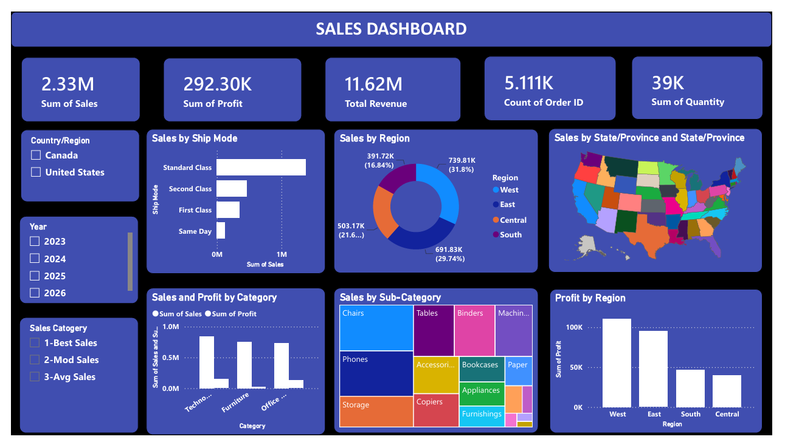

# 📊 Sales Performance Dashboard – Power BI

## 📌 Introduction

An interactive **Sales Performance Dashboard** created using Microsoft Power BI to analyze sales, profit, revenue, quantity, products, and regional performance.

## 📸 Dashboard Preview

## 🛠️ Tools Used

* Microsoft Power BI
* Power Query
* DAX
* Data Modeling
* Data Visualization

## 🎯 Objective

To transform raw sales data into an interactive dashboard that provides meaningful **business insights and supports data-driven decision making**.

## ⭐ Key Features

* KPI Cards – Sales, Profit, Revenue & Quantity
* Sales & Profit by Category
* Regional & State-wise Analysis
* Sub-Category Performance
* Shipping Mode Analysis
* Interactive Slicers & Filters
* Custom Map Tooltip
* Details / Drill-through Page

## 🎓 Skills Gained

* Data Cleaning & Transformation
* DAX Measures
* Data Modeling
* Dashboard Design
* Interactive Visualization
* Business & Sales Analysis

## 🏁 Conclusion

This project strengthened my practical knowledge of **Power BI, DAX, Power Query, and data analytics**, while providing hands-on experience in converting raw data into an interactive and business-focused dashboard.
